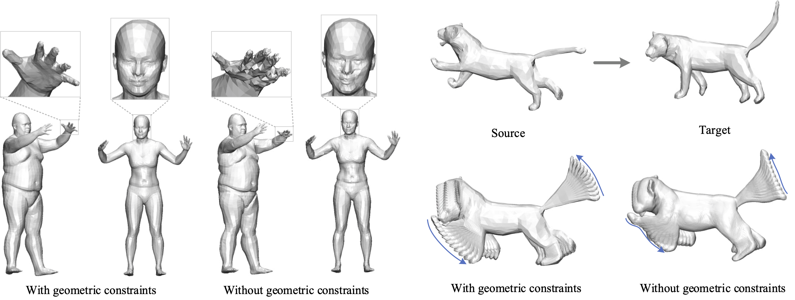

# ARAPReg
Code for ICCV 2021 paper: [ARAPReg: An As-Rigid-As Possible Regularization Loss for Learning Deformable Shape Generators.](https://arxiv.org/pdf/2108.09432.pdf).
<p align="center"> 

</p>

## Installation
The code is developed using `Python 3.6` and `cuda 10.2` on Ubuntu 18.04. 
* [Pytorch](https://pytorch.org/) (1.9.0)
* [Pytorch Geometric](https://github.com/rusty1s/pytorch_geometric)
* [OpenMesh](https://github.com/nmaxwell/OpenMesh-Python) (1.1.3)
* [MPI-IS Mesh](https://github.com/MPI-IS/mesh): We suggest to install this library from the source.
* [tqdm](https://github.com/tqdm/tqdm)

Note that Pytorch and Pytorch Geometric versions might change with your cuda version. 


## Data Preparation
We provide data for 3 datasets: [DFAUST](https://dfaust.is.tue.mpg.de/), [SMAL](https://smal.is.tue.mpg.de/) and Bone dataset. 

### DFAUST
We use 4264 test shapes and 32933 training shapes from DFaust dataset.
You can download the dataset [here](https://drive.google.com/file/d/1BaACAdJO0uoH5P084Gw11a_j3nKVSUjn/view?usp=sharing).
Please place `dfaust.zip` in `data/DFaust/raw/`.

### SMAL
We use 400 shapes from the family 0 in SMAL dataset. We generate shapes by the SMAL demo where the mean and the variance of the pose vectors are set to 0 and 0.2. We split them to 300 training and 100 testing samples. 

You can download the generated dataset [here](https://drive.google.com/file/d/1L3n6i097bgZtNYAmnGM9NwOWBNd4c1Fr/view?usp=sharing).
After downloading, please move the downloaded `smal.zip` to `./data/SMAL/raw`.

### Bone
We created a conventional bone dataset with 4 categories: tibia, pelvis, scapula and femur. Each category has about 50 shapes. We split them to 40 training and 10 testing samples. 
You can download the dataset [here](https://drive.google.com/file/d/1Naq1F6V-Oxw4AQZJeaCKfRrOCQneF0gT/view?usp=sharing).
After downloading, please move `bone.zip` to `./data` then extract it. 


## Testing
### Pretrained checkpoints
You can find pre-trained models and training logs in the following paths:

**DFAUST**: [checkpoints.zip](https://drive.google.com/file/d/1mCiF-XkMWPNDih4mmxRn6aaPnTAHdpK0/view?usp=sharing). Uncompress it under repository root will place two checkpoints in `DFaust/out/arap/checkpoints/` and `DFaust/out/arap/test_checkpoints/`.

**SMAL**: [smal_ckpt.zip](https://drive.google.com/file/d/1IIAW5SmylMHsFpU-croeu-uNPdKP_fnL/view?usp=sharing).  Move it to `./work_dir/SMAL/out`, then extract it. 

**Bone**: [bone_ckpt.zip](https://drive.google.com/file/d/15I-uABi6_-2qM3QG40Df9G9oNh-K55Nl/view?usp=sharing). Move it to `./work_dir`, then extract it. It contains checkpoints for 4 bone categories. 

### Run testing 
After putting pre-trained checkpoints to their corresponding paths, you can run the following scripts to optimize latent vectors for shape reconstruction. Note that our model has the auto-decoder architecture, so there's still a latent vector training stage for testing shapes. 

Note that both SMAL and Bone checkpoints were trained on a single GPU. Please keep `args.distributed` `False` in `main.py`. In your own training, you can use multiple GPUs. 

**DFAUST**:
```
bash test_dfaust.sh
```
**SMAL**:
```
bash test_smal.sh
```
**Bone**:
```
bash test_smal.sh
```
Note that for bone dataset, we train and test 4 categories seperately. Currently there's `tibia` in the training and testing script. You can replace it with `femur`, `pelvis` or `scapula` to get results for other 3 categories. 


## Model training 
To retrain our model, run the following scripts after downloading and extracting datasets. 

**DFAUST**:
Note that on DFaust, it is preferred to have multiple GPUs for better efficiency. The script on DFaust tracks the reconstruction error to avoid over-fitting.
```
bash train_and_test_dfaust.sh
```
**SMAL**:
```
bash train_smal.sh
```
**Bone**:
```
bash train_bone.sh
```


## Train on a new dataset
Data preprocessing and loading scripts are in `./datasets`.
To train on a new dataset, please write data loading file similar to `./datasets/dfaust.py`. Then add the dataset to `./datasets/meshdata.py` and `main.py`. Finally you can write a similar training script like `train_and_test_dfaust.sh`. 


